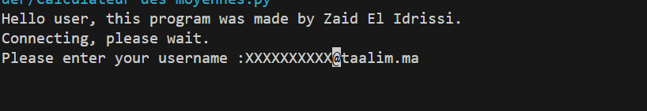
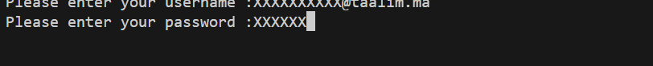
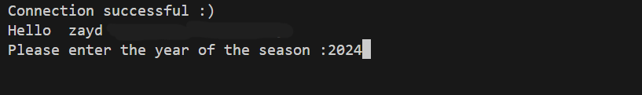
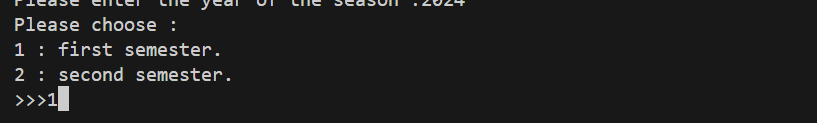
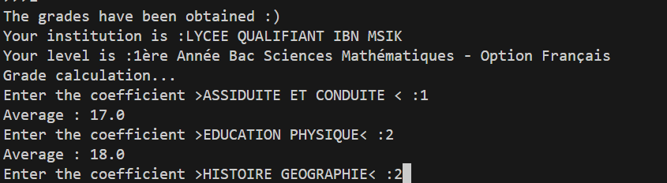
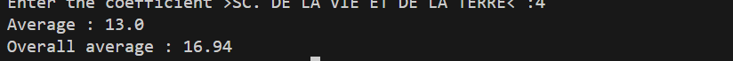

# Massar Grades Calculator


## Description
This **Python** program allows students to automatically calculate their **overall average** from the grades available on Morocco’s **Massar portal**. It logs into the student account, fetches the report cards, and calculates both **subject-wise averages** and the **general average**.

---

## Features
- Secure login to the Massar portal  
- Automatic retrieval of student report cards  
- Calculates averages per subject, including activity scores and coefficients  
- Calculates the overall general average  

---

## ❗ Requirements
Make sure you have the required Python libraries installed:

```bash
pip install -r requirements.txt 
```
---

## 📜 Usage

1- Download or clone this repository.

2- Run the Python script:

```bash
python calculateur_massar.py
```
3- Follow the on-screen instructions:
---
- Enter your Massar username.

  
---
- Enter your password.
  
  
---
- Enter the academic year and semester you want to check.
  
  
  
---
- Enter the coefficients for each subject when prompted.
  
  
---
The program will display each subject’s average and your overall average.

  

---
##📖 How it works
- Logs into the **Massar** platform (Moroccan student portal).
- Creates a session and sets the required **cookies**.
- Requests the **authentication token (`__RequestVerificationToken`)** from the login page.
- Prompts the user to enter **username and password** for login.
- Sends a **POST request** to log in and checks if login is successful.
- If login succeeds, displays the student’s name; if it fails, the program exits.
- Prompts the user to enter the **school year and semester**.
- Retrieves the student’s **grades (bulletins)** from the site using a GET request.
- Parses the HTML using **BeautifulSoup** to extract grades for each subject.
- Uses helper functions to calculate averages accurately:
  - Converts numbers with commas to floats (`vergulfloat`).
  - Converts numbers to fractions (`m_fr`).
  - Performs operations on fractions (`op_fr`).
  - Converts fractions back to decimals (`fRtn`).
  - Rounds numbers to a maximum of 5 digits (`Majeuré`).
- Calculates each subject average considering continuous assessment, activities, and ratios (coefficients).
- Prompts the user to enter **coefficients for each subject** to calculate the **overall average**.
- Prints each subject’s average and the **overall average**.

---

## Notes

- Developed by Zaid el Idrissi.
- The script only works with valid student accounts on the Massar portal.
- Make sure to input your credentials and coefficients correctly.

---

## License
This project is licensed under the **MIT License**. See the [LICENSE](LICENSE) file for details.
